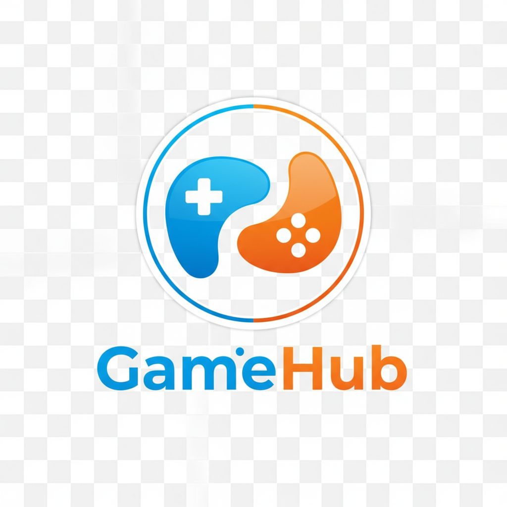

# GameHub - Ultimate Mini-Games Platform

🎮 **Your Ultimate Destination for Browser-Based Mini-Games**

A comprehensive full-stack entertainment website featuring browser-based mini-games with leaderboards, achievements, social features, and an extensible game framework. Built for casual gamers aged 13-35 with enterprise-level architecture and performance.



## ✨ Features

### 🎯 Core Gaming Features
- **📚 Extensive Game Library** - Categorized collection of mini-games
- **🏆 Global Leaderboards** - Compete with players worldwide
- **🌟 Achievement System** - Unlock badges and earn rewards  
- **📱 Mobile-First Design** - Responsive across all devices
- **🎨 HTML5 Canvas Games** - Interactive gameplay with 60fps performance

### 🔐 User Experience
- **🔑 JWT Authentication** - Secure user accounts and profiles
- **👥 Social Features** - Share scores and compete with friends
- **📊 Progress Tracking** - Detailed stats and performance analytics
- **🎭 Custom Avatars** - Personalized user profiles
- **🔔 Real-time Updates** - Live leaderboards and notifications

### 🚀 Technical Excellence
- **⚡ Sub-2 Second Load Times** - Optimized performance targets
- **♿ WCAG 2.1 AA Compliance** - Full accessibility support
- **🔒 Enterprise Security** - JWT-based auth with rate limiting
- **📱 PWA Support** - Install as native mobile app
- **🌐 Extensible Framework** - Easy to add new games

## 🛠 Tech Stack

### Frontend
- **React.js 19** with TypeScript
- **Next.js 15** with App Router
- **Tailwind CSS** for styling
- **Framer Motion** for animations
- **HTML5 Canvas** for game rendering
- **Phaser.js/Pixi.js** integration ready

### Backend
- **Node.js** with Express.js
- **MongoDB** with Mongoose ODM
- **JWT Authentication** with bcrypt
- **Socket.IO** for real-time features
- **Express Rate Limiting** for security

### Design System
- **Primary Color**: `#4A2DEF` (Vibrant Blue)
- **Secondary Color**: `#FF5733` (Energetic Orange) 
- **Typography**: Montserrat Bold (headings), Open Sans (body), Roboto Condensed (game UI)
- **Custom Generated Assets**: Brand logos, category icons, achievement badges

## 🎨 Visual Identity

The platform features a cohesive visual language with:
- Colorful cartoon-style game icons and illustrations
- Consistent brand elements across all components
- Custom-generated visual assets that align with the gaming aesthetic
- Modern gradient effects and neon highlights for gaming feel

## 🚀 Quick Start

### Prerequisites
- Node.js 18+ and npm
- MongoDB 4.4+
- Git

### Installation

1. **Clone the repository**
```bash
git clone https://github.com/yourusername/gamehub-platform.git
cd gamehub-platform
```

2. **Install dependencies**
```bash
# Install frontend dependencies
npm install

# Install backend dependencies
cd server
npm install
cd ..
```

3. **Environment Setup**
```bash
# Copy environment files
cp server/.env.example server/.env

# Configure your environment variables in server/.env
```

4. **Start Development Servers**
```bash
# Start both frontend and backend
npm run dev:full

# Or start separately:
npm run dev          # Frontend only
npm run dev:server   # Backend only
```

5. **Access the Application**
- Frontend: http://localhost:3000
- Backend API: http://localhost:5000
- Health Check: http://localhost:5000/health

## 📁 Project Structure

```
gamehub-platform/
├── src/                          # Frontend source code
│   ├── app/                      # Next.js App Router pages
│   │   ├── page.tsx             # Homepage
│   │   ├── games/               # Game library pages
│   │   ├── leaderboards/        # Leaderboard pages
│   │   └── achievements/        # Achievement pages
│   ├── components/              # React components
│   │   ├── ui/                  # Base UI components
│   │   ├── game-canvas.tsx      # HTML5 Canvas game component
│   │   ├── game-card.tsx        # Game display cards
│   │   └── social-sharing.tsx   # Social media integration
│   ├── lib/                     # Utilities and mock data
│   └── hooks/                   # Custom React hooks
├── server/                      # Backend source code
│   ├── src/
│   │   ├── models/             # MongoDB schemas
│   │   ├── routes/             # API endpoints
│   │   ├── middleware/         # Express middleware
│   │   └── utils/              # Backend utilities
│   └── package.json            # Backend dependencies
├── public/                     # Static assets
│   └── generated/              # AI-generated brand assets
└── docs/                       # Documentation
```

## 🎮 Game Development

### Adding New Games

1. **Create Game Component**
```typescript
// src/components/games/YourGame.tsx
export function YourGame({ onScoreUpdate, onGameEnd }) {
  // Implement your game logic
}
```

2. **Add to Game Registry**
```typescript
// src/lib/games/index.ts
import { YourGame } from '@/components/games/YourGame';

export const gameRegistry = {
  'your-game-id': YourGame,
  // ... other games
};
```

3. **Update Mock Data**
```typescript
// src/lib/mock-data.ts
const newGame = {
  id: 'your-game-id',
  title: 'Your Game Title',
  category: 'puzzle',
  // ... game metadata
};
```

### Game Canvas Integration

The platform provides a flexible `GameCanvas` component that supports:
- HTML5 Canvas 2D rendering
- Phaser.js integration
- Pixi.js support
- Real-time score updates
- Performance monitoring (60fps target)

## 🏗 API Documentation

### Authentication Endpoints
- `POST /api/auth/register` - User registration
- `POST /api/auth/login` - User login
- `GET /api/auth/me` - Get current user
- `PUT /api/auth/profile` - Update profile

### Game Management
- `GET /api/games` - Get all games (with filtering)
- `GET /api/games/:id` - Get specific game
- `POST /api/games/:id/play` - Record game session
- `POST /api/games/:id/rate` - Rate a game

### Leaderboards
- `GET /api/leaderboards/game/:gameId` - Get game leaderboards
- `POST /api/leaderboards/:id/submit` - Submit score

### User Management
- `GET /api/users/:id` - Get user profile
- `GET /api/users/:id/friends` - Get user's friends
- `GET /api/achievements` - Get all achievements

## 📊 Performance Targets

### Frontend Performance
- **Page Load Time**: < 2 seconds
- **First Contentful Paint**: < 1.2 seconds
- **Largest Contentful Paint**: < 2.5 seconds
- **Cumulative Layout Shift**: < 0.1

### Game Performance  
- **Frame Rate**: 60fps consistent
- **Input Lag**: < 100ms
- **Memory Usage**: < 512MB per game session

### Backend Performance
- **API Response Time**: < 200ms (95th percentile)
- **Database Query Time**: < 50ms average
- **Concurrent Users**: 10,000+ supported

## 🔒 Security Features

- JWT-based authentication with secure token storage
- Password hashing with bcrypt (12 rounds)
- Rate limiting (100 requests per 15 minutes)
- CORS protection with whitelist
- Input validation with Joi
- SQL injection prevention via Mongoose
- XSS protection headers
- CSRF token validation

## ♿ Accessibility

WCAG 2.1 AA compliance includes:
- Keyboard navigation support
- Screen reader compatibility  
- Color contrast ratios 4.5:1+
- Alternative text for images
- Focus management
- Semantic HTML structure
- ARIA labels and roles

## 🌍 Deployment

### Production Build
```bash
# Build frontend
npm run build

# Build backend
npm run build:server
```

### Environment Variables
Key production variables to configure:
- `MONGODB_URI` - Production database URL
- `JWT_SECRET` - Secure JWT signing key
- `FRONTEND_URL` - Production frontend domain
- `NODE_ENV=production`

### Recommended Stack
- **Frontend**: Vercel, Netlify, or AWS CloudFront
- **Backend**: Railway, Heroku, or AWS EC2
- **Database**: MongoDB Atlas or AWS DocumentDB
- **CDN**: Cloudflare or AWS CloudFront

## 🧪 Testing

```bash
# Run frontend tests
npm run test

# Run backend tests  
npm run test:server

# Run E2E tests
npm run test:e2e

# Check type coverage
npm run typecheck
```

## 📈 Analytics & Monitoring

- Performance monitoring with Web Vitals
- Error tracking with Sentry (optional)
- User analytics with custom events
- Game engagement metrics
- Real-time player statistics

## 🤝 Contributing

1. Fork the repository
2. Create feature branch (`git checkout -b feature/amazing-feature`)
3. Commit changes (`git commit -m 'Add amazing feature'`)
4. Push to branch (`git push origin feature/amazing-feature`)
5. Open Pull Request

### Development Guidelines
- Follow TypeScript strict mode
- Use semantic commit messages
- Write tests for new features
- Maintain WCAG 2.1 AA compliance
- Follow established design patterns

## 📄 License

This project is licensed under the MIT License - see the [LICENSE](LICENSE) file for details.

## 🎯 Roadmap

### Phase 1 (Current)
- ✅ Core gaming platform
- ✅ User authentication
- ✅ Basic game library
- ✅ Leaderboards & achievements

### Phase 2 (Next)
- 🔄 Multiplayer games support
- 🔄 Tournament system
- 🔄 Advanced social features
- 🔄 Mobile app (React Native)

### Phase 3 (Future)
- ⏳ Game creator tools
- ⏳ Monetization features
- ⏳ Advanced analytics
- ⏳ AI-powered recommendations

## 💬 Support

- 📧 Email: support@gamehub.com
- 💬 Discord: [GameHub Community](https://discord.gg/gamehub)
- 📖 Documentation: [docs.gamehub.com](https://docs.gamehub.com)
- 🐛 Issues: [GitHub Issues](https://github.com/yourusername/gamehub-platform/issues)

---

**Built with ❤️ for the gaming community**

*GameHub - Play. Compete. Achieve.*
